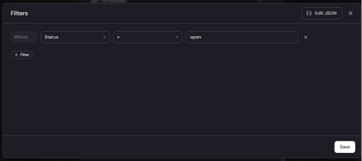
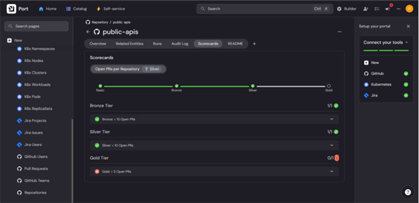

# Port Support Engineer Assignment

**Candidate:** Asomugha Divine  
**Date:** 11/08/2025  

### Table of Contents
1. [Exercise #1 – JQ Patterns](#exercise-1--jq-patterns)  
2. [Exercise #2 – Jira & GitHub Integration](#exercise-2--jira--github-integration)  
3. [Exercise #3 – PR Count Scorecard](#exercise-3--pr-count-scorecard)  
4. [Exercise #4 – GitHub Workflow Troubleshooting](#exercise-4--github-workflow-troubleshooting)

---

## Exercise #1 – JQ Patterns

### 1(a) Extract current replica count
```jq
.spec.replicas
```
**Explanation**: Retrieves the integer value of the current replica count from a Kubernetes Deployment object.


---

### 1(b) Extract deployment strategy
```jq
.spec.strategy.type
```
**Explanation**: Retrieves the deployment strategy type (e.g., RollingUpdate or Recreate).


---

### 1(c) Extract the “service” label of the deployment concatenated with the “environment” label of the deployment, with a hyphen (-) in the middle.
```jq
.metadata.labels.service + “-” + .metadata.labels.environment
```
**Explanation**: Accesses the two label values and concatenates them into a single string. 


Image proof from local pc.


---

### 2 Extract all subtask issue IDs
```jq
[.fields.subtasks[].key]
```
**Explanation**: .fields.subtasks (array of subtasks) and extracts the key of each.


---

## Exercise #2 – Jira & GitHub Integration
### Steps Taken:  
1. **Signed Up to Port with this email. divine+port@solmateai.site.**
2. **Installed Port's GitHub app and authorized repos.**
  
   image below shows the installed getport github application.


3. **Created Jira project (Excercise2) with Scrum template (company-managed).**

   images below shows the created Jira project.  
     

     
   
4. **Installed Port Ocean Integration for Jira via Helm.**
  
   image below shows the installation instruction for Port Ocean Integration for Jira 
   

   image below shows the helm command for the Port Ocean Integrator deployment on Kubernetes.
   

   image below shows the Port Ocean Integrator pod running in Kubernetes 
   

5. **Added relation Jira Issue → Repository.**
  
   image below shows the added relation btw Jira issues and GitHub repositories
   

6. **Created matching Jira components for repos.**

   images below show the components and the repositories with matching names
   
   
   

7. **Updated Jira integration mapping.**

   image below shows the Jira issue updated mapping.  
   

   image below shows the Audit Log to show that the mapping works  
   

   

---

## Exercise #3 – PR Count Scorecard 

1. **Added the aggregation property named openPrs**
   
   image below shows the added Aggregation property 
   

   Images below show the steps for the Aggregation property setup
   
   

2. **Added the scorecard logic to the Repository blueprint**
```jq
{ 
  "identifier": "open_prs_scorecard", 
  "title": "Open PRs per Repository", 
  "levels": [ 
    { 
      "color": "paleBlue", 
      "title": "Basic" 
    }, 
    { 
      "color": "bronze", 
      "title": "Bronze" 
    }, 
    { 
      "color": "silver", 
      "title": "Silver" 
    }, 
    { 
      "color": "gold", 
      "title": "Gold" 
    } 
  ], 
  "rules": [ 
    { 
      "identifier": "open_prs_gold", 
      "title": "Gold: < 5 Open PRs", 
      "level": "Gold", 
      "query": { 
        "combinator": "and", 
        "conditions": [ 
          { 
            "operator": "<", 
            "property": "open_prs", 
            "value": 5 
          } 
        ] 
      } 
    }, 
    { 
      "identifier": "open_prs_silver", 
      "title": "Silver: < 10 Open PRs", 
      "level": "Silver", 
      "query": { 
        "combinator": "and", 
        "conditions": [ 
          { 
            "operator": "<", 
            "property": "open_prs", 
            "value": 10 
          } 
        ] 
      } 
    }, 
    { 
      "identifier": "open_prs_bronze", 
      "title": "Bronze: < 15 Open PRs", 
      "level": "Bronze", 
      "query": { 
        "combinator": "and", 
        "conditions": [ 
          { 
            "operator": "<", 
            "property": "open_prs", 
            "value": 15 
          } 
        ] 
      } 

    } 

  ] 

} 
  ```
   
   image below shows the scorecard for the repository EagleEye with 1 open PR 
   
    
   image below shows the scorecard for the repository public-apis with 6 open PR 
   
   
   


## Exercise #4 – GitHub Workflow Troubleshooting

### Step 1. Verify Action Backend Configuration 

**Organization, Repository, and Workflow Name:** 
Double-check that the self-service action in Port is configured with the correct GitHub organization, repository, and workflow file name. Any typo or mismatch will most likely prevent the workflow from being triggered. This is a common cause and will result in the action being stuck in progress with no activity in GitHub. 

**Workflow Location:** 
Ensure the workflow file exists in the .github/workflows/ directory of the specified repository and branch. 

---

### Step 2. GitHub App Installation 

**App Installation:** 
Confirm that Port’s GitHub App is installed in the correct GitHub organization and on the relevant repository. 

**Permissions:** 
The GitHub App must have the necessary permissions (Actions, Pull Requests, Contents, etc.) and be installed on the repository where the workflow resides. 
 
---

### Step 3. Workflow Trigger Configuration 

**workflow_dispatch Trigger:** 
The workflow must be configured to use the workflow_dispatch trigger. Without this, it cannot be triggered remotely by Port. 

**Branch Existence:** 
If specifying a branch via the ref key, customer has to ensure the workflow file exists in the default branch as well, due to GitHub’s requirements. 

---

### Step 4. Secrets and Authentication 

**Port Credentials:** 
Ensure the GitHub repository contains the correct PORT_CLIENT_ID and PORT_CLIENT_SECRET as secrets, if required by your workflow. 

**GitHub Token:** 
If using a webhook invocation, verify that the GitHub token used has the necessary permissions and is correctly referenced in Port’s secrets. 

---

### Step 5. Logs and Error Messages 

**Check Port UI and Logs:** 
Look for any error messages in the Port UI or logs. Sometimes, errors such as “Got 404 while addressing github api, repo or workflow not found” indicate misconfiguration of org, repo, or workflow names. 

**GitHub Workflow Runs:** 
Check the Actions tab in the GitHub repository to see if any workflow runs were triggered or if there are any failed runs. 

---

### Step 6. Additional Checks 

**Action Organization/Repository:** 
If using templates or guides, ensure you have replaced all placeholder values (e.g., <GITHUB_ORG>, <GITHUB_REPO>) with your actual organization and repository names. 

**Secrets in Port:** 
Make sure all required secrets are set in Port (e.g., GitHub tokens, Port credentials). 
 
